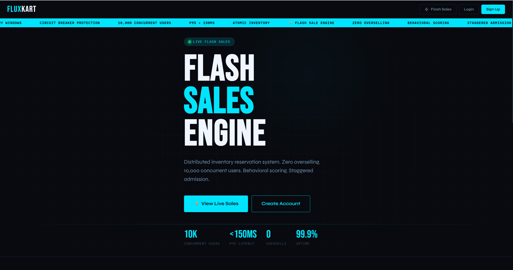

# FluxKart — Distributed Flash Sale Engine

[](https://fastapi.tiangolo.com/)
[](https://react.dev/)
[](https://www.python.org/)
[](https://www.postgresql.org/)
[](https://redis.io/)
[](https://www.rabbitmq.com/)
[](https://kubernetes.io/)
[](https://www.docker.com/)
[](https://opentelemetry.io/)

**Production-grade distributed flash sale engine** that solves thundering herd traffic, inventory oversell, and queue fairness problems at scale — the same engineering challenges faced by Amazon Great Indian Festival and Flipkart Big Billion Days. Built with FastAPI, Redis Lua atomic scripts, RabbitMQ with Outbox pattern for guaranteed delivery, PostgreSQL with PgBouncer connection pooling, and a React frontend with a BookMyShow-style virtual waiting room. Full observability through Prometheus, Grafana, and OpenTelemetry distributed tracing with Jaeger. Deployed on Kubernetes with HorizontalPodAutoscaler for automatic pod scaling under load.

---

## Table of Contents
- [Architecture](#architecture)
- [Key Features](#key-features)
- [Tech Stack](#tech-stack)
- [Project Structure](#project-structure)
- [Workflow](#workflow)
- [Installation & Setup](#installation--setup)
- [Running Load Tests](#running-load-tests)
- [Observability](#observability)
- [Kubernetes Deployment](#kubernetes-deployment)
- [Database Migrations](#database-migrations)
- [Environment Variables](#environment-variables)
- [Output Screenshots](#output-screenshots)
- [Notes on Excluded Files](#notes-on-excluded-files)

---

## Architecture

```
  ┌──────────────────────────────────────────────────────────────────────┐
  │                            Clients                                    │
  │              React 18 (Vite) — JWT Auto-Refresh                      │
  └───────────────────────────────┬──────────────────────────────────────┘
                                  │ HTTP
                                  ▼
  ┌──────────────────────────────────────────────────────────────────────┐
  │                    Nginx (Single Entry Point)                         │
  │         least-conn Load Balancing │ IP-based Rate Limiting            │
  └───────────────────┬───────────────────────────┬──────────────────────┘
                      │                           │
          ┌───────────▼──────────┐   ┌────────────▼─────────┐
          │     FastAPI API 1    │   │    FastAPI API 2      │
          │  JWT Auth │ SSE      │   │  JWT Auth │ SSE       │
          │  Per-user Rate Limit │   │  Per-user Rate Limit  │
          └───┬────────┬─────────┘   └──┬─────────┬─────────┘
              │        │                │         │
      ┌───────▼──┐  ┌──▼───────────┐  ┌▼─────────▼──────────────────┐
      │  Redis 7 │  │  PgBouncer   │  │        RabbitMQ 3.13         │
      │          │  │              │  │                              │
      │ Lua Script  │ Transaction  │  │  fluxkart.direct exchange    │
      │ Atomic   │  │ Pool Mode    │  │  fluxkart.orders queue       │
      │ Inventory│  │ 10K → 90     │  │  Dead Letter Queue           │
      │ Decrement│  │ connections  │  │  Outbox Pattern              │
      │          │  │              │  │  Circuit Breaker             │
      │ Waiting  │  │      │       │  └──────────────┬───────────────┘
      │ Room     │  │      │       │                 │
      │ Queue    │  │      ▼       │                 ▼
      │ Trust    │  │ PostgreSQL 17│  ┌──────────────────────────────┐
      │ Score    │  │              │  │      Consumer Worker          │
      │ Cache    │  │ users        │  │                              │
      │ Outbox   │  │ sales        │  │  Order Consumer              │
      └──────────┘  │ inventory    │  │  Expiry Worker               │
                    │ reservations │  │  Outbox Worker               │
                    │ orders       │  │  Reconciliation Worker       │
                    │ outbox_events│  │  Heartbeat Worker            │
                    │ preregistr.. │  │  DLQ Monitor                 │
                    └──────────────┘  │  Admission Worker            │
                                      └──────────────────────────────┘

  ┌──────────────────────────────────────────────────────────────────────┐
  │                         Observability Stack                           │
  │   Prometheus (metrics) │ Grafana (dashboards) │ Jaeger (traces)      │
  │        OpenTelemetry — traces span all services end-to-end           │
  └──────────────────────────────────────────────────────────────────────┘

  ┌──────────────────────────────────────────────────────────────────────┐
  │                     Kubernetes (Production)                           │
  │   HPA: 2 → 10 API pods │ PgBouncer sidecar │ K8s Secrets            │
  │        Liveness + Readiness probes on every pod                      │
  └──────────────────────────────────────────────────────────────────────┘
```

---

## Key Features

### Inventory Management
- **Atomic inventory reservation** via Redis Lua scripts — prevents oversell under any concurrent load by combining check-and-decrement in a single atomic operation
- **Redis ↔ PostgreSQL reconciliation worker** — periodically detects and auto-corrects inventory drift between Redis and the database
- **Inventory expiry worker** — bulk processes expired reservations in a single DB round trip, releasing inventory back to the pool

### Queue & Admission Control
- **Virtual waiting room** — SSE-based real-time queue (BookMyShow/IPL style) with live position updates pushed to the client
- **Pre-registration system** — users register before the sale starts; staggered admission worker admits users in controlled FIFO batches at 500 users/sec
- **Heartbeat mechanism** — removes ghost users from the queue, prevents inflated wait times (Ticketmaster's solution to queue position drift)

### Reservation & Payment
- **Reservation squatting prevention** — behavioral trust scoring dynamically shortens TTL for suspicious users (bots, scalpers) from 15 min down to 3 min
- **Legitimate abandonment recovery** — trusted users who lose their reservation get a grace period window to reclaim it without going back to the queue
- **Quantity modification** — users can increase or decrease reservation quantity atomically; TTL resets on every modification
- **Cart & simulated payment portal** — UPI, QR, and card payment flows with full order lifecycle management
- **Payment idempotency** — prevents double charges on retries by caching payment results in Redis for 24 hours using a deterministic key derived from user ID + order ID + amount
- **One purchase per user per sale** — enforced at the database level, prevents multi-account abuse

### Reliability & Messaging
- **Outbox pattern** — reservation INSERT and outbox_event INSERT happen in a single atomic PostgreSQL transaction. A separate worker publishes to RabbitMQ. If RabbitMQ is down, events accumulate in the outbox and publish automatically when it recovers — zero message loss guaranteed
- **Circuit breaker** — tracks RabbitMQ publish failures; auto-opens after 5 failures, closes after 30s cooldown. Prevents cascading failures under broker instability
- **Dead letter queue (DLQ)** — failed messages are routed to a DLQ after max retries. A DLQ monitor alerts when the threshold is breached
- **Consumer idempotency** — order consumer checks reservation status before processing; duplicate messages are safely skipped

### Security & Rate Limiting
- **Two-layer rate limiting** — Nginx handles IP-based limits (volumetric attacks); FastAPI dependency handles per-user limits via Redis sliding window Lua script (5 reservation attempts per 60 seconds)
- **JWT auth with auto-refresh** — access tokens (30 min) + refresh tokens (7 days); frontend silently refreshes before expiry
- **Correlation IDs** — every request gets a UUID correlation ID propagated through all logs for end-to-end traceability

### Observability
- **Prometheus + Grafana** — metrics dashboards for request rates, reservation latency, inventory levels, circuit breaker state, rate limit hits
- **OpenTelemetry + Jaeger** — distributed traces spanning API → Redis → PostgreSQL → RabbitMQ → Consumer, linked via W3C traceparent header propagated through message headers
- **Structured logging** — JSON-ready via structlog with correlation IDs and contextual fields on every log line

### Infrastructure
- **PgBouncer** — transaction-mode connection pooler; multiplexes 10,000 app connections into 90 PostgreSQL connections
- **Kubernetes manifests** — full K8s deployment with HPA (2→10 pods auto-scaling at 60% CPU), liveness and readiness probes, K8s Secrets for credentials
- **Sale lifecycle workers** — auto-activate and auto-expire sales at scheduled times without manual intervention
- **Admin CRUD panel** — full admin interface to create, edit, delete sales, manage users, and monitor system health

---

## Tech Stack

| Layer | Technology |
|:---|:---|
| Backend | Python 3.12, FastAPI, asyncpg, uvloop |
| Frontend | React 18, Vite |
| Database | PostgreSQL 17 |
| Cache & Queue State | Redis 7 |
| Message Broker | RabbitMQ 3.13 |
| Connection Pool | PgBouncer (transaction mode) |
| Load Balancer | Nginx |
| Observability | Prometheus, Grafana, OpenTelemetry, Jaeger |
| Orchestration | Docker Compose (dev), Kubernetes with HPA (prod) |
| Load Testing | k6 |

---

## Project Structure

```text
FluxKart/
├── assets/                         # Screenshots for README
├── backend/
│   ├── app/
│   │   ├── consumers/
│   │   │   └── order_consumer.py   # RabbitMQ message consumer — processes orders
│   │   ├── db/
│   │   │   └── queries/
│   │   │       ├── orders.py       # Reservation + order SQL queries
│   │   │       ├── outbox.py       # Outbox pattern DB queries
│   │   │       ├── preregistrations.py
│   │   │       ├── sales.py
│   │   │       └── users.py
│   │   ├── middleware/
│   │   │   ├── correlation_id.py   # Injects UUID correlation ID per request
│   │   │   └── rate_limiter.py     # Sliding window rate limiter (Lua + EVAL)
│   │   ├── models/
│   │   │   └── schemas.py          # Pydantic request/response schemas
│   │   ├── routers/
│   │   │   ├── admin.py            # Admin CRUD — sales, users, system health
│   │   │   ├── auth.py             # Login, register, refresh token
│   │   │   ├── health.py           # Health check endpoint
│   │   │   ├── orders.py           # Order listing, payment simulation
│   │   │   ├── reservations.py     # Reserve, recover, modify quantity, SSE queue
│   │   │   └── sales.py            # Sale listing and detail
│   │   ├── services/
│   │   │   ├── inventory_service.py    # Redis Lua atomic inventory operations
│   │   │   ├── queue_service.py        # Virtual waiting room queue management
│   │   │   └── reservation_service.py  # Full reservation orchestration + outbox
│   │   ├── utils/
│   │   │   ├── circuit_breaker.py  # Redis-backed circuit breaker
│   │   │   ├── degradation.py      # Graceful degradation + fallback logic
│   │   │   ├── dlq_monitor.py      # Dead letter queue monitor + alerting
│   │   │   ├── idempotency.py      # Payment idempotency via Redis
│   │   │   ├── metrics.py          # Prometheus custom metrics definitions
│   │   │   ├── security.py         # JWT encode/decode, password hashing
│   │   │   └── user_score.py       # Behavioral trust score calculation + TTL
│   │   ├── workers/
│   │   │   ├── admission_worker.py     # Staggered queue admission (500 users/sec)
│   │   │   ├── expiry_worker.py        # Bulk expire reservations + release inventory
│   │   │   ├── heartbeat_worker.py     # Remove ghost users from queue
│   │   │   ├── outbox_worker.py        # Poll outbox table, publish to RabbitMQ
│   │   │   └── reconciliation_worker.py # Redis ↔ PostgreSQL inventory drift fix
│   │   ├── config.py               # Pydantic settings — all env vars
│   │   ├── dependencies.py         # FastAPI DI — DB pool, Redis, RabbitMQ, channel pool
│   │   ├── main.py                 # FastAPI app — startup, middleware, routers
│   │   └── telemetry.py            # OpenTelemetry setup — FastAPI, asyncpg, Redis
│   ├── alembic/
│   │   └── versions/               # Database migration files
│   ├── consumers/
│   │   └── run_consumer.py         # Worker process entry point — all background workers
│   ├── k8s/
│   │   ├── api/deployment.yaml     # API Deployment + Service + HPA
│   │   ├── consumer/deployment.yaml
│   │   ├── nginx/deployment.yaml
│   │   ├── pgbouncer/deployment.yaml
│   │   ├── rabbitmq/deployment.yaml
│   │   ├── redis/deployment.yaml
│   │   ├── configmap.yaml          # Non-sensitive config
│   │   ├── secrets.yaml            # Base64 encoded credentials
│   │   ├── namespace.yaml
│   │   └── deploy.bat              # Windows deploy script
│   ├── nginx/
│   │   └── nginx.conf              # Nginx load balancer config
│   ├── pgbouncer/
│   │   └── pgbouncer.ini           # PgBouncer pool config
│   ├── scripts/
│   │   ├── create_test_users.py    # Creates 5000 test users for load testing
│   │   ├── generate_tokens.py      # Pre-generates JWT tokens (bypasses bcrypt)
│   │   ├── reset_sales.py          # Resets inventory + timers for testing
│   │   └── seed_data.py            # Seeds admin account + sample sale
│   ├── tests/                      # Test suite
│   ├── .env.example                # Environment variable template
│   ├── docker-compose.yml          # Full local dev stack
│   ├── Dockerfile
│   ├── load_test.js                # k6 load test — sustained + thundering herd modes
│   ├── prometheus.yml              # Prometheus scrape config
│   └── requirements.txt
└── frontend/
    ├── src/
    │   ├── api/
    │   │   └── client.js           # Axios client with JWT auto-refresh interceptor
    │   ├── components/
    │   │   ├── CountdownTimer.jsx  # Live sale countdown
    │   │   ├── InventoryBar.jsx    # Real-time inventory level bar
    │   │   ├── Navbar.jsx
    │   │   ├── SaleCard.jsx
    │   │   └── WaitingRoom.jsx     # SSE-based live queue position component
    │   ├── context/
    │   │   └── AuthContext.jsx     # Global auth state + token management
    │   ├── hooks/
    │   │   └── useCountdown.js
    │   ├── pages/
    │   │   ├── Account.jsx
    │   │   ├── Admin.jsx           # Admin panel — sales, users, system tabs
    │   │   ├── Cart.jsx            # Cart + UPI/QR/card payment portal
    │   │   ├── Landing.jsx
    │   │   ├── Login.jsx
    │   │   ├── Orders.jsx          # Paid + cancelled orders tabs
    │   │   ├── Profile.jsx
    │   │   ├── Register.jsx
    │   │   ├── SaleDetail.jsx      # Sale detail + reserve button + waiting room
    │   │   └── Sales.jsx           # Active sales listing
    │   └── styles/
    │       └── global.css
    ├── index.html
    ├── package.json
    └── vite.config.js
```

---

## Workflow

This section describes the complete flow from user registration to order completion.

### 1. Pre-Registration
A user pre-registers for an upcoming flash sale. The system records their intent and places them in the pre-registration list. When the sale approaches, the admission worker begins processing the pre-registration list and issues admission tokens in controlled FIFO batches at 500 users/sec — preventing all users from hitting the reservation endpoint simultaneously.

### 2. Sale Goes Live
At the scheduled start time, the auto-activate worker transitions the sale status to `active`. Users who have been admitted receive a token allowing them to bypass the queue and proceed directly to reservation. Users without an admission token are placed into the virtual waiting room queue.

### 3. Virtual Waiting Room
Users in the queue receive real-time position updates via Server-Sent Events — a persistent HTTP connection that pushes updates every 2 seconds without polling. The heartbeat worker continuously removes ghost users (users who closed their browser without explicitly leaving the queue), ensuring queue positions reflect reality.

### 4. Reservation
Once admitted, the user submits a reservation request:
- The user's **behavioral trust score** is calculated from order history, abandonment rate, and account age. This determines the reservation TTL (3–15 minutes).
- A **Redis Lua script** atomically checks available inventory and decrements it in a single operation — making oversell impossible even at 5000 concurrent requests.
- The **reservation record** and an **outbox event** are written to PostgreSQL in a single atomic transaction.
- The outbox worker publishes the event to RabbitMQ. If RabbitMQ is temporarily unavailable, the event stays in the outbox and publishes when the broker recovers — zero message loss.

### 5. Order Processing
The RabbitMQ consumer receives the reservation event and:
- Checks idempotency — skips if the reservation is already confirmed
- Creates the order record in PostgreSQL
- Marks the reservation as `confirmed` — preventing the expiry worker from releasing the inventory
- Updates `reserved_quantity` in the inventory table

### 6. Cart & Payment
The user reviews their cart and proceeds to payment. The simulated payment portal supports UPI, QR code, and card flows. Payment idempotency is enforced — if the user submits payment twice (double-click, network retry), only one charge is processed. The idempotency key is derived from `user_id + order_id + amount` and cached in Redis for 24 hours.

### 7. Order Confirmation
On successful payment the order status transitions to `paid`. The user can view their confirmed orders in the Orders page. The sale's sold quantity is updated, and the inventory counters are reconciled.

### 8. Expiry & Recovery
If the user does not complete payment within the TTL window, the expiry worker bulk-releases the inventory back to the pool. Trusted users (high behavioral score) receive a recovery window — a grace period during which they can reclaim their reservation without returning to the queue.

### 9. Sale Expiry
At the scheduled end time, the auto-expire worker transitions the sale to `completed`. All remaining `pending` reservations are expired and inventory is released.

---

## Installation & Setup

### Prerequisites
- Python 3.12
- Node.js 18+
- Docker Desktop
- PostgreSQL 17 (running locally)
- conda (recommended) or virtualenv

### 1. Clone the repository
```bash
git clone https://github.com/dhaya56/FluxKart.git
cd FluxKart
```

### 2. Backend setup
```bash
cd backend

# Create conda environment
conda create -n FluxKart python=3.12
conda activate FluxKart

# Install dependencies
pip install -r requirements.txt

# Configure environment
cp .env.example .env
# Edit .env — set POSTGRES_PASSWORD, JWT_SECRET_KEY, and other values
```

### 3. Database setup
```bash
# Create the database in PostgreSQL
psql -U postgres -c "CREATE DATABASE fluxkart_db;"

# Run all migrations
alembic upgrade head

# Seed initial data (creates admin account + sample sale)
python scripts/seed_data.py
```

### 4. Start all services
```bash
docker compose up -d
```

Wait 60 seconds for all services to initialize, then verify:
```bash
curl http://localhost/health
```

Expected response:
```json
{
  "status": "healthy",
  "services": {
    "postgresql": "healthy",
    "redis": "healthy",
    "rabbitmq": "healthy"
  }
}
```

### 5. Frontend setup
```bash
cd ../frontend
npm install
npm run dev
```

| Service | URL |
|:---|:---|
| Frontend | http://localhost:5173 |
| Backend API | http://localhost |

### 6. Admin account
```
Email:    dhaya@fluxkart.com
Password: 123
```

---

## Running Load Tests

```bash
cd backend

# Step 1 — Create 5000 test users (one time only)
python scripts/create_test_users.py

# Step 2 — Generate JWT tokens (re-run if expired after 30 min)
python scripts/generate_tokens.py

# Step 3 — Reset sale inventory before each test run
python scripts/reset_sales.py

# Sustained load test (ramps to 2000 VUs)
docker compose --profile loadtest run --rm \
  -e SALE_ID=<your-sale-id> \
  k6 run /scripts/load_test.js

# Thundering herd test (5000 VU spike at T=0)
docker compose --profile loadtest run --rm \
  -e SALE_ID=<your-sale-id> \
  -e MODE=herd \
  k6 run /scripts/load_test.js
```

> Get the SALE_ID from the admin panel at `http://localhost/admin` or directly from the database.

---

## Observability

| Service | URL | Credentials |
|:---|:---|:---|
| Grafana | http://localhost:3000 | admin / (set in .env) |
| Prometheus | http://localhost:9090 | — |
| Jaeger (Tracing) | http://localhost:16686 | — |
| RabbitMQ Management | http://localhost:15672 | fluxkart / fluxkart123 |

In Jaeger, select service `fluxkart-api` → operation `POST /reservations` to see full distributed traces spanning the API, Redis, PostgreSQL, RabbitMQ, and the consumer worker — all linked via W3C traceparent header propagated through RabbitMQ message headers.

---

## Kubernetes Deployment

### Prerequisites
- minikube
- kubectl

```bash
# Start minikube
minikube start --driver=docker --memory=4096 --cpus=2

# Deploy all services
cd backend
k8s\deploy.bat

# Verify all pods are running
kubectl get pods -n fluxkart

# Check HPA status
kubectl get hpa -n fluxkart

# Access the service
minikube service nginx-service -n fluxkart
```

The HPA automatically scales API pods from 2 to 10 when CPU utilization exceeds 60%.

---

## Database Migrations

```bash
# Apply all pending migrations
alembic upgrade head

# Create a new migration
alembic revision --autogenerate -m "your_migration_description"

# Rollback one migration
alembic downgrade -1

# View migration history
alembic history
```

---

## Environment Variables

Copy `backend/.env.example` to `backend/.env` and configure:

| Variable | Description |
|:---|:---|
| `POSTGRES_PASSWORD` | PostgreSQL password |
| `JWT_SECRET_KEY` | Secret key for JWT signing — use a long random string in production |
| `RABBITMQ_PASSWORD` | RabbitMQ password |
| `GF_SECURITY_ADMIN_PASSWORD` | Grafana admin password |
| `JAEGER_OTLP_ENDPOINT` | Jaeger collector endpoint (default: `http://jaeger:4317`) |
| `APP_ENV` | `development` or `production` — disables Swagger UI in production |
| `RESERVATION_TTL_SECONDS` | How long a reservation is held before inventory is released (default: 600) |

---

## Output Screenshots

> Screenshots are stored in the `assets/` folder at the repository root.

### Landing Page


### Sales Listing


### Sale Detail & Reserve


### Virtual Waiting Room


### Cart & Payment Portal


### Orders Page


### Admin Panel


### Jaeger Distributed Trace


### Grafana Dashboard


---

## Notes on Excluded Files

The following files and folders are intentionally excluded from version control:

| File / Folder | Reason | How to Proceed |
|:---|:---|:---|
| `backend/.env` | Contains passwords and JWT secret | Copy `backend/.env.example` to `backend/.env` and fill in your values |
| `backend/pgbouncer/userlist.txt` | Contains PostgreSQL password in plain text | Create manually: `"postgres" "your_password"` |
| `backend/scripts/tokens.json` | Contains JWT tokens generated for load testing | Run `python scripts/generate_tokens.py` to regenerate |
| `frontend/node_modules/` | Node.js dependencies | Run `npm install` inside the `frontend/` folder |
| `backend/__pycache__/` | Python bytecode cache | Generated automatically when running the app |

---